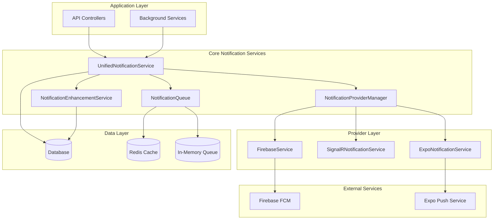

# New Notification Service Architecture Design

## 🏗️ Architecture Overview

The new notification system will consist of 4 core services that replace the existing 16 services while preserving all functionality.



## 🎯 Core Services Design

### 1. **UnifiedNotificationService**

**Purpose**: Single entry point for all notification operations

**Key Responsibilities**:
- Create and persist notifications in database
- Check user preferences and permissions
- Route notifications to appropriate providers
- Handle immediate vs queued delivery decisions
- Coordinate with enhancement services

**Interface Design**:
```csharp
public interface IUnifiedNotificationService
{
    // Core notification methods
    Task<bool> SendNotificationAsync(NotificationRequest request);
    Task<bool> SendTestNotificationAsync(int userId);
    Task<bool> SendMulticastNotificationAsync(List<int> userIds, NotificationRequest request);
    
    // Specific notification types
    Task SendMessageNotificationAsync(int userId, string senderUsername, string content, int conversationId);
    Task SendMentionNotificationAsync(int userId, string mentionerUsername, int postId, int? commentId = null);
    Task SendFollowNotificationAsync(int userId, string followerUsername);
    Task SendLikeNotificationAsync(int userId, string likerUsername, int postId);
    Task SendCommentNotificationAsync(int userId, string commenterUsername, int postId, int commentId);
    
    // Management methods
    Task<NotificationStats> GetStatsAsync();
    Task<bool> IsHealthyAsync();
}
```

**Key Features**:
- Validates user preferences before sending
- Creates database notification records
- Determines delivery method (immediate/queued)
- Handles notification type-specific logic
- Integrates with all enhancement services

### 2. **NotificationProviderManager**

**Purpose**: Manage notification providers with intelligent fallback

**Key Responsibilities**:
- Register and manage notification providers
- Health check and availability monitoring
- Intelligent provider selection and fallback
- Load balancing across providers
- Provider-specific message formatting

**Interface Design**:
```csharp
public interface INotificationProviderManager
{
    // Provider management
    Task<bool> SendNotificationAsync(NotificationDeliveryRequest request);
    Task<List<IRealtimeNotificationProvider>> GetAvailableProvidersAsync();
    Task<IRealtimeNotificationProvider?> GetBestProviderAsync(int userId, string notificationType);
    
    // Health monitoring
    Task RefreshProviderHealthAsync();
    Task<Dictionary<string, ProviderHealth>> GetProviderHealthAsync();
    
    // Configuration
    Task UpdateProviderPriorityAsync(string providerName, int priority);
    Task EnableProviderAsync(string providerName, bool enabled);
}
```

**Provider Selection Logic**:
1. **Primary**: Firebase (mobile push notifications)
2. **Secondary**: SignalR (real-time web notifications)
3. **Fallback**: Expo (alternative mobile push)
4. **Last Resort**: Database notification only

**Key Features**:
- Automatic failover between providers
- Provider health monitoring with circuit breaker
- Configurable provider priorities
- Load balancing for high-volume notifications
- Provider-specific optimizations

### 3. **NotificationQueue**

**Purpose**: Unified queuing and retry system for offline users

**Key Responsibilities**:
- Queue notifications for offline users
- Smart retry logic with exponential backoff
- User connectivity tracking
- Background processing of queued notifications
- Queue management and cleanup

**Interface Design**:
```csharp
public interface INotificationQueue
{
    // Queuing operations
    Task QueueNotificationAsync(QueuedNotification notification);
    Task<List<QueuedNotification>> GetPendingNotificationsAsync(int userId);
    Task ProcessPendingNotificationsAsync();
    Task ProcessUserNotificationsAsync(int userId);
    
    // User connectivity
    Task MarkUserOnlineAsync(int userId, string connectionType);
    Task MarkUserOfflineAsync(int userId);
    Task<bool> IsUserOnlineAsync(int userId);
    Task<UserConnectivityStatus> GetUserConnectivityAsync(int userId);
    
    // Queue management
    Task<QueueStats> GetQueueStatsAsync();
    Task CleanupExpiredNotificationsAsync();
    Task RetryFailedNotificationsAsync();
}
```

**Queue Strategy**:
- **Immediate Delivery**: For online users
- **Short-term Queue**: In-memory for users expected back soon (< 1 hour)
- **Long-term Queue**: Database-backed for extended offline periods
- **Smart Retry**: Exponential backoff with jitter
- **Expiration**: Configurable TTL for different notification types

**Key Features**:
- Hybrid in-memory/database queuing
- Intelligent retry with error classification
- User connectivity state management
- Automatic queue cleanup and maintenance
- Priority-based processing

### 4. **NotificationEnhancementService** (Optional)

**Purpose**: Cross-cutting concerns as optional, configurable features

**Key Responsibilities**:
- Metrics collection and reporting
- Security auditing and compliance
- Rate limiting and spam prevention
- Content filtering and sanitization
- Payload compression and optimization

**Interface Design**:
```csharp
public interface INotificationEnhancementService
{
    // Metrics
    Task<NotificationMetrics> GetMetricsAsync(TimeSpan? timeWindow = null);
    Task RecordNotificationEventAsync(NotificationEvent notificationEvent);
    
    // Security and Auditing
    Task<bool> ShouldAllowNotificationAsync(int userId, string notificationType);
    Task LogSecurityEventAsync(SecurityEvent securityEvent);
    
    // Content Processing
    Task<ContentFilterResult> FilterContentAsync(string content);
    Task<CompressedPayload> CompressPayloadAsync(object payload);
    
    // Rate Limiting
    Task<RateLimitResult> CheckRateLimitAsync(int userId, string notificationType);
    Task RecordNotificationSentAsync(int userId, string notificationType);
}
```

**Enhancement Features**:
- **Metrics**: Real-time performance monitoring
- **Auditing**: Comprehensive security and compliance logging
- **Rate Limiting**: Configurable limits per user/type
- **Content Filtering**: Spam, profanity, and malicious content detection
- **Compression**: Payload optimization for mobile networks
- **Analytics**: Notification effectiveness tracking

## 🔄 Service Interactions

### Typical Notification Flow:
1. **API/Background Service** calls `UnifiedNotificationService.SendNotificationAsync()`
2. **UnifiedNotificationService** checks user preferences and creates database record
3. **UnifiedNotificationService** calls `NotificationEnhancementService` for rate limiting/filtering
4. **UnifiedNotificationService** determines if user is online via `NotificationQueue`
5. If **online**: Routes to `NotificationProviderManager` for immediate delivery
6. If **offline**: Queues via `NotificationQueue` for later delivery
7. **NotificationProviderManager** selects best provider and attempts delivery
8. **NotificationEnhancementService** records metrics and audit events

### Background Processing:
1. **NotificationQueue** periodically processes queued notifications
2. Checks user connectivity status
3. Routes online users' notifications to `NotificationProviderManager`
4. Updates retry counts and schedules for failed deliveries
5. Cleans up expired notifications

## 📊 Migration Benefits

### Quantitative Improvements:
- **Service Count**: 16 → 4 (75% reduction)
- **Dependencies**: ~50 → ~15 (70% reduction)
- **Code Complexity**: Estimated 40% reduction
- **Test Surface**: 60% reduction in mocking complexity

### Qualitative Improvements:
- **Single Entry Point**: Clear notification API
- **Unified Configuration**: One place for all notification settings
- **Better Error Handling**: Consistent error handling across all providers
- **Easier Debugging**: Clear service boundaries and responsibilities
- **Performance**: Reduced overhead from multiple service layers

## 🚀 Implementation Strategy

### Phase-by-Phase Implementation:
1. **Phase 2**: Implement `UnifiedNotificationService` alongside existing services
2. **Phase 3**: Implement `NotificationProviderManager` and migrate provider logic
3. **Phase 4**: Implement `NotificationQueue` and consolidate queuing logic
4. **Phase 5**: Implement `NotificationEnhancementService` for cross-cutting concerns
5. **Phase 6**: Migrate all notification creation points to new services
6. **Phase 7**: Remove obsolete services and clean up

### Backward Compatibility:
- Keep existing interfaces during migration
- Use feature flags to switch between old/new systems
- Gradual migration of notification types
- Comprehensive testing at each phase
